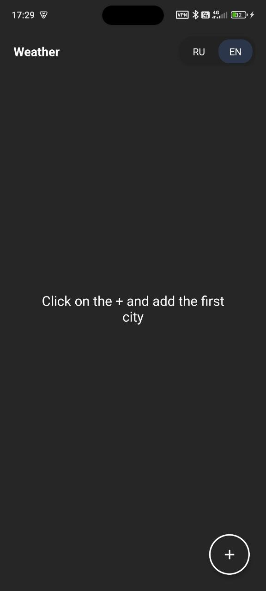

# Практическая работа 3. Использование локальной базы данных SQLite.

-Использована локальная БД SQLite, интегрированнная в Android Studio. Добавлены методы получения, добавления и удаления записей из Базы данных(обновление данных в приложении не предусмотрено)
-Реализована локализация интерфейса. Поддерживаемые языки - Русский и Английский. Для перевода названий городов был использован API Google Translate.
-В интерфейс добавлена кнопка для удаления выбранной карточки города.

*при сборке могут возникнуть 4 ошибки, связанные с устаревшими методами, они не влияют на работоспособность приложения

## Android-приложение WeatherApp. Инструкция по сборке apk-файла

Необходимые инструменты для сборки APK: Android SDK, Java, и Gradle.

1. Клонирование репозитория
 ``` Shell
 git clone https://github.com/LyubomirChumachenko/WeatherApp_PR3.git
 ```
2. Открытие директории
 ``` cmd
 cd WeatherApp_PR3
 ```
3. Установка переменных окружения (если не установлены в системе)
 ``` cmd
 export JAVA_HOME=/путь/к/jdk
 export ANDROID_HOME=$HOME/Android/Sdk
 export PATH=$PATH:$ANDROID_HOME/tools:$ANDROID_HOME/platform-tools
 ```
4. Сборка
 ``` cmd
 gradlew.bat assembleDebug
 ```
5. Готовый `.apk` файл будет лежать
 ``` lua
 app\build\outputs\apk\debug\app-debug.apk
 ```




